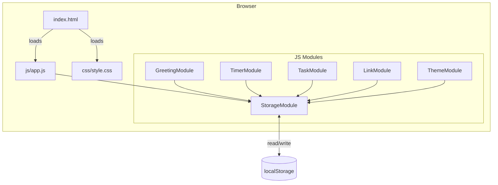
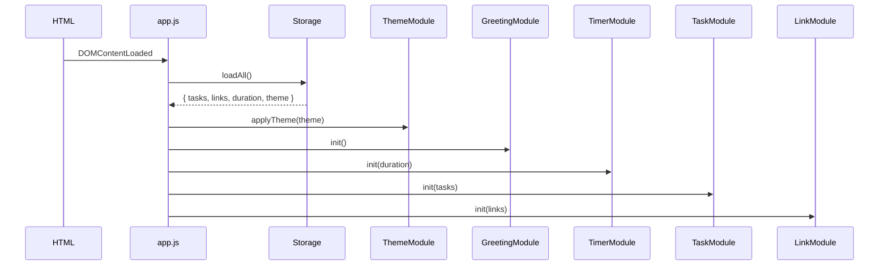

# Design Document: To-Do List Life Dashboard

## Overview

The To-Do Life Dashboard is a single-page, zero-dependency web application delivered as a static directory.
It runs entirely in the browser — no server, no build step, no framework. Persistence is handled exclusively
through `localStorage`. The visual identity is a dark theme with pink accents, switchable to a light theme.

### Architectural Principles

- **No external runtime dependencies.** All logic lives in one JS file; all styling in one CSS file.
- **Separation of concerns inside a single module.** The JS file is organised into clearly named IIFE-scoped
  modules (Storage, Timer, Tasks, Links, Greeting, Theme) that communicate through direct function calls and
  DOM events. No module bundler is needed.
- **Fail-soft storage.** Every localStorage read/write is wrapped in try/catch. Missing or corrupt data falls
  back to safe defaults so the app never shows a blank screen.
- **Accessibility first.** Semantic HTML5, `aria-live` regions for dynamic content, visible focus rings, and
  sufficient colour contrast ratios in both themes.

---

## Architecture

### High-Level Component Diagram



### Module Responsibilities

| Module | Responsibility |
|---|---|
| `StorageModule` | Wraps all `localStorage` access; serialises/deserialises JSON; handles quota errors |
| `GreetingModule` | Drives the clock (`setInterval` at 1 s), date string, and time-of-day greeting |
| `TimerModule` | Pomodoro countdown (`setInterval` at 1 s), custom duration, audio signal |
| `TaskModule` | Task CRUD, sort state, rendering, inline edit/validation |
| `LinkModule` | Quick-link CRUD, max-20 cap, URL validation, new-tab opener |
| `ThemeModule` | Dark/light toggle, CSS class application, persistence |

### Initialisation Sequence



---

## Components and Interfaces

### StorageModule

```js
// Public API
StorageModule.getTasks()      → Task[]
StorageModule.setTasks(tasks) → void   // throws StorageError on quota exceeded
StorageModule.getLinks()      → Link[]
StorageModule.setLinks(links) → void
StorageModule.getDuration()   → number  // minutes, default 25
StorageModule.setDuration(n)  → void
StorageModule.getTheme()      → "dark" | "light"
StorageModule.setTheme(t)     → void
```

All getters catch `JSON.parse` errors and type-validation failures, returning the appropriate default.
All setters catch `QuotaExceededError` and re-throw a typed `StorageError` so callers can show user-visible
error messages.

### GreetingModule

```js
GreetingModule.init() → void
// Side effects:
//   - Sets up setInterval(tick, 1000)
//   - tick() updates #clock, #date, #greeting DOM nodes
//   - Reads Date.now() on every tick
```

Greeting logic:

| Hour range | Greeting text |
|---|---|
| 00:00 – 11:59 | "Good Morning" |
| 12:00 – 17:59 | "Good Afternoon" |
| 18:00 – 23:59 | "Good Evening" |

If `new Date()` throws (environment cannot determine local time), the module renders a static
`"Time unavailable"` placeholder and suppresses the greeting.

### TimerModule

```js
TimerModule.init(durationMinutes) → void
TimerModule.start()  → void   // idempotent; no-op if already running
TimerModule.stop()   → void
TimerModule.reset()  → void
TimerModule.setCustomDuration(minutes) → void | ValidationError
// Internal: tick() decrements remaining seconds, updates #timer-display
// On 00:00: clearInterval, playBeep()
```

**Custom duration validation:** only integers in [1, 120]. Invalid input shows an inline error and leaves
the current duration unchanged. The duration input is disabled (`disabled` attribute set) while the timer
is active.

**Audio signal:** An `AudioContext` tone (or a fallback `<audio>` element with a data-URI encoded beep) is
played when the countdown reaches 00:00 and lasts at least 1 second.

### TaskModule

```js
TaskModule.init(tasks)             → void
TaskModule.addTask(description)    → Task | ValidationError
TaskModule.editTask(id, newDesc)   → Task | ValidationError
TaskModule.toggleComplete(id)      → void
TaskModule.deleteTask(id)          → void
TaskModule.setSortOrder(order)     → void  // "created" | "alpha" | "completion"
TaskModule.render()                → void  // re-renders task list from in-memory state
```

**In-memory state:** `TaskModule` keeps a `tasks: Task[]` array in memory. Every mutating operation
updates this array and then calls `StorageModule.setTasks(tasks)` before calling `render()`.

**Sort implementation (in-memory, non-destructive):**

| Sort order | Primary criterion | Tiebreaker |
|---|---|---|
| `created` (default) | `createdAt` ascending | — |
| `alpha` | `description.toLowerCase()` A–Z | `createdAt` ascending |
| `completion` | incomplete first (`completed === false`), then complete | `createdAt` ascending |

Sorting produces a display copy; the canonical array order (and Storage) always uses insertion order.

**Render logic:**
- Clears `<ul id="task-list">` and rebuilds it from the sorted copy.
- Each `<li>` contains: checkbox, `<span>` (description, strikethrough when complete), edit button, delete button.
- Inline edit mode replaces the `<span>` with an `<input>` pre-filled with the description.

### LinkModule

```js
LinkModule.init(links)             → void
LinkModule.addLink(label, url)     → Link | ValidationError
LinkModule.deleteLink(id)          → void
LinkModule.render()                → void
```

**Validation rules:**

| Field | Rule |
|---|---|
| `label` | 1–50 characters, non-empty after trim |
| `url` | starts with `http://` or `https://`, max 2048 characters |
| max links | max 20 stored; reject and show error when at capacity |

Links open in a new tab via `window.open(url, '_blank', 'noopener,noreferrer')`.

### ThemeModule

```js
ThemeModule.init(theme)     → void   // applies theme class to <html>
ThemeModule.toggle()        → void   // flips theme, persists, re-applies
ThemeModule.getCurrent()    → "dark" | "light"
```

Theme is applied by toggling the CSS class `theme-dark` / `theme-light` on `<html>`.
All colour variables are declared as CSS custom properties scoped to each class (see Styling section).

---

## Data Models

### Task

```js
/**
 * @typedef {Object} Task
 * @property {string}  id          - UUID v4 generated at creation time (crypto.randomUUID())
 * @property {string}  description - 1–500 characters (trimmed)
 * @property {boolean} completed   - false on creation; toggled by user
 * @property {number}  createdAt   - Unix timestamp (ms) from Date.now() at creation
 */
```

**Storage key:** `"tld_tasks"`
**Storage format:** JSON array of Task objects
**Default:** `[]`

### Link

```js
/**
 * @typedef {Object} Link
 * @property {string} id    - UUID v4 generated at creation time
 * @property {string} label - 1–50 characters (trimmed)
 * @property {string} url   - http(s) URL, max 2048 characters
 */
```

**Storage key:** `"tld_links"`
**Storage format:** JSON array of Link objects
**Default:** `[]`
**Constraint:** Maximum 20 entries

### Session Duration

```js
/**
 * @type {number}  - Integer minutes, range [1, 120]
 */
```

**Storage key:** `"tld_duration"`
**Storage format:** Plain integer serialised as JSON number
**Default:** `25`

### Theme

```js
/**
 * @type {"dark" | "light"}
 */
```

**Storage key:** `"tld_theme"`
**Storage format:** JSON string
**Default:** `"dark"`

### Storage Schema Summary

| Key | Type | Default | Constraints |
|---|---|---|---|
| `tld_tasks` | `Task[]` | `[]` | Each task: description 1–500 chars |
| `tld_links` | `Link[]` | `[]` | Max 20 entries; URL starts with http(s) |
| `tld_duration` | `number` | `25` | Integer in [1, 120] |
| `tld_theme` | `"dark"\|"light"` | `"dark"` | Enum; invalid value → `"dark"` |

### Validation on Read

When loading from Storage, each retrieved value is validated against its schema:

1. **`tld_tasks`** — must be an array; each element must have `id` (string), `description` (string, 1–500), `completed` (boolean), `createdAt` (number). Invalid elements are silently dropped; if the whole value fails, return `[]`.
2. **`tld_links`** — must be an array of at most 20 items; each must have `id` (string), `label` (string, 1–50), `url` (string starting with `http://` or `https://`, ≤ 2048 chars). Invalid elements dropped; whole failure → `[]`.
3. **`tld_duration`** — must be an integer in [1, 120]; any other value → `25`.
4. **`tld_theme`** — must be `"dark"` or `"light"`; any other value → `"dark"`.

### HTML Structure Outline

```html
<!DOCTYPE html>
<html lang="en" class="theme-dark">
  <head>…</head>
  <body>
    <header>
      <h1>…</h1>
      <button id="theme-toggle" aria-label="Switch theme">…</button>
    </header>
    <main>
      <!-- Greeting Panel -->
      <section aria-label="Greeting" id="greeting-panel">
        <time id="clock" aria-live="off"></time>
        <p id="date"></p>
        <p id="greeting" aria-live="polite"></p>
      </section>

      <!-- Focus Timer -->
      <section aria-label="Focus Timer" id="timer-panel">
        <output id="timer-display">25:00</output>
        <button id="timer-start">Start</button>
        <button id="timer-stop">Stop</button>
        <button id="timer-reset">Reset</button>
        <label>Session duration
          <input id="duration-input" type="number" min="1" max="120">
        </label>
        <p id="duration-error" role="alert" aria-live="assertive"></p>
      </section>

      <!-- Task Manager -->
      <section aria-label="Task Manager" id="task-panel">
        <form id="task-form">
          <input id="task-input" type="text" maxlength="200">
          <button type="submit">Add</button>
          <p id="task-input-error" role="alert" aria-live="assertive"></p>
        </form>
        <nav aria-label="Sort tasks">
          <button data-sort="created">Date</button>
          <button data-sort="alpha">A–Z</button>
          <button data-sort="completion">Status</button>
        </nav>
        <ul id="task-list" aria-live="polite" aria-label="Task list"></ul>
        <p id="task-storage-error" role="alert" aria-live="assertive"></p>
      </section>

      <!-- Quick Links -->
      <section aria-label="Quick Links" id="links-panel">
        <form id="link-form">
          <input id="link-label-input" type="text" maxlength="50">
          <input id="link-url-input" type="url" maxlength="2048">
          <button type="submit">Add Link</button>
          <p id="link-error" role="alert" aria-live="assertive"></p>
        </form>
        <ul id="link-list" aria-live="polite"></ul>
      </section>
    </main>
  </body>
</html>
```

### CSS Architecture

All colours are expressed as CSS custom properties:

```css
/* Dark theme (default) */
html.theme-dark {
  --bg-surface:    #1a1a2e;
  --bg-card:       #16213e;
  --text-primary:  #e0e0e0;
  --text-muted:    #a0a0b0;
  --accent:        #ff6b9d;   /* pink */
  --accent-hover:  #ff8fb3;
  --border:        #2a2a4a;
  --error:         #ff5555;
}

/* Light theme */
html.theme-light {
  --bg-surface:    #f8f8f8;
  --bg-card:       #ffffff;
  --text-primary:  #1a1a2e;
  --text-muted:    #666680;
  --accent:        #d6336c;   /* pink */
  --accent-hover:  #e8527f;
  --border:        #d0d0e0;
  --error:         #c0392b;
}
```

Theme transitions use `transition: background-color 80ms ease, color 80ms ease` to stay under the 100 ms
responsiveness requirement.

**Responsive layout strategy:** CSS Grid with `auto-fill` columns for the main panel grid.
On narrow viewports (< 600px) a single-column stack is used. On wider viewports a 2-column or 4-column
auto-fill grid is used, allowing panels to flow naturally.

```css
main {
  display: grid;
  grid-template-columns: repeat(auto-fill, minmax(280px, 1fr));
  gap: 1.5rem;
  padding: 1rem;
}
```

---

## Correctness Properties

*A property is a characteristic or behavior that should hold true across all valid executions of a system — essentially, a formal statement about what the system should do. Properties serve as the bridge between human-readable specifications and machine-verifiable correctness guarantees.*

### Property 1: Greeting is consistent with local hour

*For any* system time, the greeting string produced by `GreetingModule` is exactly "Good Morning" when the hour is 0–11, "Good Afternoon" when 12–17, and "Good Evening" when 18–23.

**Validates: Requirements 1.3, 1.4, 1.5**

---

### Property 2: Clock display matches actual time

*For any* `Date` object, the formatted HH:MM:SS string produced by `GreetingModule.formatTime` matches the hours, minutes, and seconds of that date (zero-padded to 2 digits each).

**Validates: Requirements 1.1**

---

### Property 3: Timer countdown decrements correctly

*For any* valid session duration in [1, 120] minutes and any elapsed whole-second count k ≤ duration_seconds, the remaining-seconds value after k ticks equals `duration_seconds − k` and the MM:SS display string correctly encodes that value.

**Validates: Requirements 2.1, 2.2**

---

### Property 4: Custom duration validation rejects out-of-range values

*For any* input value that is not a whole number or is outside [1, 120], `TimerModule.setCustomDuration` must return a `ValidationError` and leave the session duration unchanged.

**Validates: Requirements 2.8, 2.9**

---

### Property 5: Adding a valid task grows the list by exactly one

*For any* task list and any non-empty, non-whitespace description of 1–200 characters, calling `TaskModule.addTask` results in a task list whose length is exactly one greater than before, and the new task's description equals the trimmed input.

**Validates: Requirements 3.1**

---

### Property 6: Whitespace-only task descriptions are rejected

*For any* string composed entirely of whitespace characters (spaces, tabs, newlines), `TaskModule.addTask` must return a `ValidationError` and leave the task list unchanged.

**Validates: Requirements 3.2**

---

### Property 7: Task storage round-trip preserves data

*For any* array of valid `Task` objects written via `StorageModule.setTasks`, calling `StorageModule.getTasks` on the same Storage returns an equivalent array (same ids, descriptions, completion states, and timestamps).

**Validates: Requirements 3.4, 7.1**

---

### Property 8: Toggling completion is an involution

*For any* task, calling `TaskModule.toggleComplete` twice in succession returns the task to its original `completed` state.

**Validates: Requirements 4.4**

---

### Property 9: Sort does not mutate Storage

*For any* task list and any sort order, calling `TaskModule.setSortOrder` followed by `TaskModule.render()` must not change the array returned by `StorageModule.getTasks()` (insertion order is preserved in Storage).

**Validates: Requirements 5.2**

---

### Property 10: Sort tiebreaker preserves creation order

*For any* two tasks that are equal under the active sort criterion, the one with the earlier `createdAt` timestamp always appears first in the rendered list.

**Validates: Requirements 5.4**

---

### Property 11: Valid link addition grows link list by one

*For any* link list with fewer than 20 entries and a valid (label 1–50 chars, URL http(s), ≤ 2048 chars) link, calling `LinkModule.addLink` results in a list whose length is exactly one greater, and the added link's label and URL match the trimmed inputs.

**Validates: Requirements 6.1**

---

### Property 12: Invalid link submissions are rejected without side effects

*For any* combination of inputs that violates any link validation rule (empty label, label > 50 chars, non-http(s) URL, URL > 2048 chars, or list already at 20), `LinkModule.addLink` must return a `ValidationError` and leave the link list and Storage unchanged.

**Validates: Requirements 6.2, 6.6**

---

### Property 13: Link storage round-trip preserves data

*For any* array of valid `Link` objects written via `StorageModule.setLinks`, calling `StorageModule.getLinks` returns an equivalent array (same ids, labels, and URLs).

**Validates: Requirements 6.3, 7.2**

---

### Property 14: Theme toggle is an involution

*For any* active theme, calling `ThemeModule.toggle()` twice returns the theme to its original value, and the HTML class attribute reflects the correct theme after each call.

**Validates: Requirements 8.2**

---

### Property 15: Storage read-back after any write returns correct theme

*For any* theme value in `{"dark", "light"}`, calling `StorageModule.setTheme(t)` followed immediately by `StorageModule.getTheme()` returns `t`.

**Validates: Requirements 8.3, 7.4**

---

### Property 16: Corrupt or missing Storage values produce safe defaults

*For any* Storage state where one or more keys hold invalid, corrupt, or absent values, `StorageModule` getters must return the documented defaults (tasks: `[]`, links: `[]`, duration: `25`, theme: `"dark"`) rather than throwing or returning `undefined`.

**Validates: Requirements 7.5, 8.7**

---

### Property 17: Deleting a task removes it from both list and Storage

*For any* non-empty task list, after calling `TaskModule.deleteTask(id)` for an existing task id, that id must not appear in either the in-memory task list or the array returned by `StorageModule.getTasks()`.

**Validates: Requirements 4.5**

---

### Property 18: Deleting a link removes it from both list and Storage

*For any* non-empty link list, after calling `LinkModule.deleteLink(id)` for an existing link id, that id must not appear in either the in-memory link list or the array returned by `StorageModule.getLinks()`.

**Validates: Requirements 6.5**

---

### Property 19: Session duration storage round-trip

*For any* integer duration in [1, 120], calling `StorageModule.setDuration(n)` followed immediately by `StorageModule.getDuration()` returns `n`.

**Validates: Requirements 7.3, 2.7**

---

## Error Handling

### Storage Errors

| Scenario | Handler | User-visible outcome |
|---|---|---|
| `localStorage` unavailable (`SecurityError`, `TypeError`) | Caught in all Storage getters/setters; module-level flag `storageAvailable` set to `false` | Banner error on load; inline errors on write attempts |
| `QuotaExceededError` on write | Caught in setters; throw `StorageError` | Inline message: "Could not save — storage full" |
| `JSON.parse` failure on read | Caught in getters; return default | Silent fallback to default value |
| Schema validation failure on read | Detected in getters; return default or filter out invalid entries | Silent fallback |

### Timer Errors

| Scenario | Handler | User-visible outcome |
|---|---|---|
| Invalid custom duration | `setCustomDuration` returns `ValidationError` | Inline error adjacent to duration input |
| `AudioContext` not available | Try/catch around beep; fallback to `<audio>` element | Silent; timer still stops |

### Task Errors

| Scenario | Handler | User-visible outcome |
|---|---|---|
| Empty/whitespace description on add | `addTask` returns `ValidationError` | Inline error adjacent to input |
| Empty/whitespace description on edit | `editTask` restores original; returns `ValidationError` | Inline message in edit field |
| Storage failure on add | Task not added to display; `StorageError` caught | Inline storage error below task list |
| Storage failure on edit/complete/delete | Change retained in memory; error shown | Inline warning: "Change could not be saved" |

### Link Errors

| Scenario | Handler | User-visible outcome |
|---|---|---|
| Validation failure (any field) | `addLink` returns `ValidationError` | Inline error adjacent to the invalid field |
| List at 20-entry cap | `addLink` returns `ValidationError` | Inline error: "Maximum 20 links reached" |
| Storage failure | `StorageError` caught in setter | Inline error below link list |

### Load Failure Timeout

If the `DOMContentLoaded` event has not fired within 5 seconds (detected via a `setTimeout` set before the
script runs), a loading-failure indicator is shown with a retry button that calls `location.reload()`.

---

## Testing Strategy

### Unit Tests (example-based)

Unit tests target pure utility functions and module logic in isolation, using a mocked localStorage shim.

**Coverage targets:**

- `StorageModule` — get/set for each key, schema validation fallbacks, `QuotaExceededError` handling
- `GreetingModule.formatTime` — clock string formatting for boundary hours (00, 11, 12, 17, 18, 23)
- `GreetingModule.getGreeting` — correct string for each time band
- `TimerModule.formatCountdown` — MM:SS formatting for 0, 1, 60, 3600-1 seconds
- `TimerModule.setCustomDuration` — accept 1, 120; reject 0, 121, 1.5, "foo", -1
- `TaskModule.addTask` — valid add, empty-string rejection, whitespace rejection
- `TaskModule.editTask` — valid edit, blank-value rejection, id-not-found handling
- `TaskModule.sortTasks` — each sort order with tie cases
- `LinkModule.addLink` — all validation rules, cap at 20
- `ThemeModule.toggle` — dark→light→dark cycle

### Property-Based Tests

A property-based testing library (e.g., [fast-check](https://github.com/dubzzz/fast-check) for JavaScript)
is used to verify the universally-quantified properties defined in the Correctness Properties section.

Each property test runs a **minimum of 100 iterations**.

Every property test is tagged with a comment in the format:
`// Feature: todo-life-dashboard, Property N: <property_text>`

| Property | PBT generator description |
|---|---|
| P1: Greeting consistency | `fc.integer({ min: 0, max: 23 })` injected as mock hour |
| P2: Clock display | `fc.date()` arbitrary date object |
| P3: Timer countdown | `fc.integer({ min: 1, max: 120 })` × `fc.nat()` k ≤ duration |
| P4: Duration validation | `fc.oneof(fc.float(), fc.string(), fc.integer({ min: -1000, max: 0 }), fc.integer({ min: 121, max: 9999 }))` |
| P5: Task add grows list | `fc.array(validTask())` × `fc.string({ minLength: 1 })` filtered to non-whitespace |
| P6: Whitespace rejection | `fc.stringOf(fc.constantFrom(' ', '\t', '\n'))` |
| P7: Task storage round-trip | `fc.array(validTask(), { maxLength: 50 })` |
| P8: Toggle involution | `fc.boolean()` as initial completion state |
| P9: Sort non-mutation | `fc.array(validTask())` × `fc.constantFrom("created","alpha","completion")` |
| P10: Sort tiebreaker | `fc.array(validTask())` with randomised equal-key pairs |
| P11: Valid link add | `fc.array(validLink(), { maxLength: 19 })` × `fc.record({ label, url })` |
| P12: Invalid link rejection | generators for each invalid field combination |
| P13: Link storage round-trip | `fc.array(validLink(), { maxLength: 20 })` |
| P14: Theme toggle involution | `fc.constantFrom("dark", "light")` as start state |
| P15: Theme storage round-trip | `fc.constantFrom("dark", "light")` |
| P16: Corrupt storage defaults | `fc.anything()` for each storage key |
| P17: Task delete removes from list and Storage | `fc.array(validTask(), { minLength: 1 })` with random id selected |
| P18: Link delete removes from list and Storage | `fc.array(validLink(), { minLength: 1 })` with random id selected |
| P19: Duration storage round-trip | `fc.integer({ min: 1, max: 120 })` |

### Integration / Smoke Tests

- **Browser smoke test** (manual or Playwright): Open `index.html` in each target browser; verify all panels render, clock ticks, timer starts/stops/resets, task add/edit/delete/sort works, links open in new tab, theme toggle applies and persists.
- **Viewport test**: Resize from 320 px to 2560 px; verify no overflow or clipping.
- **Persistence test**: Add tasks and links, reload page, verify data survives.
- **Storage-unavailable test**: Block localStorage in browser settings; verify error messages appear and app still renders.
